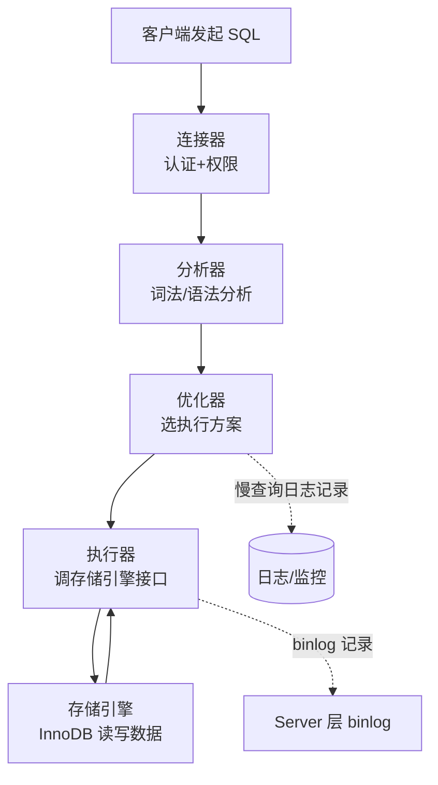
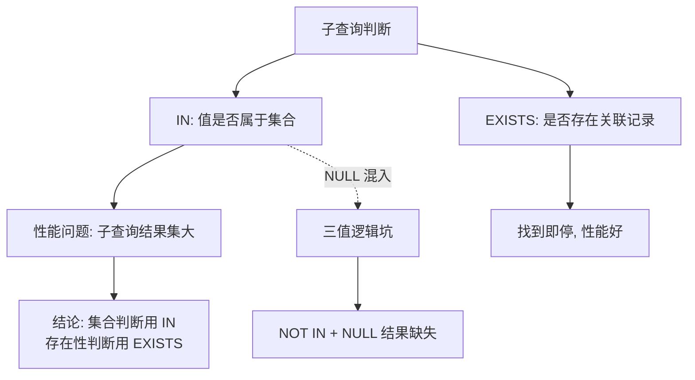
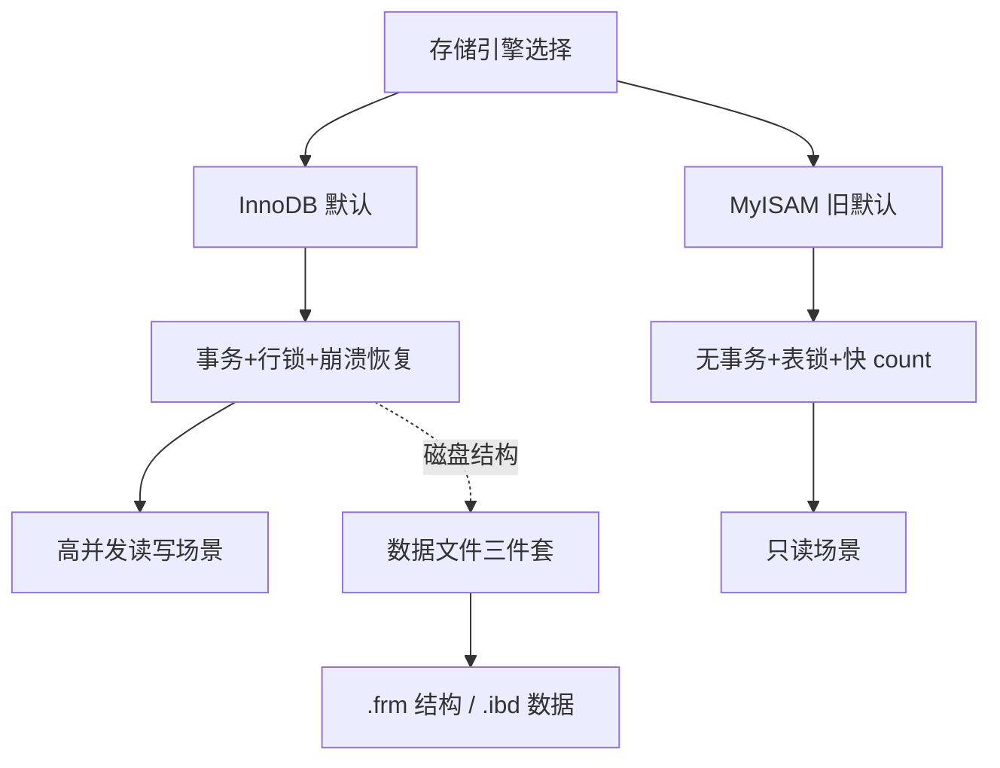
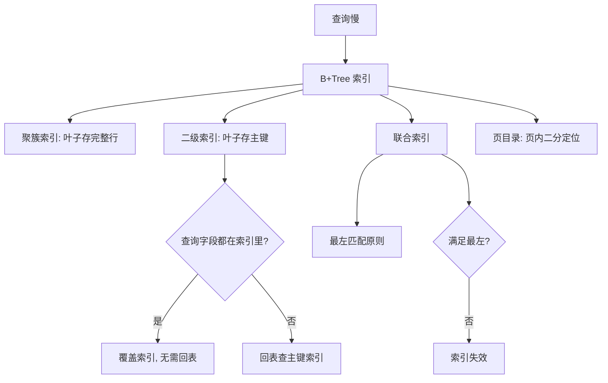
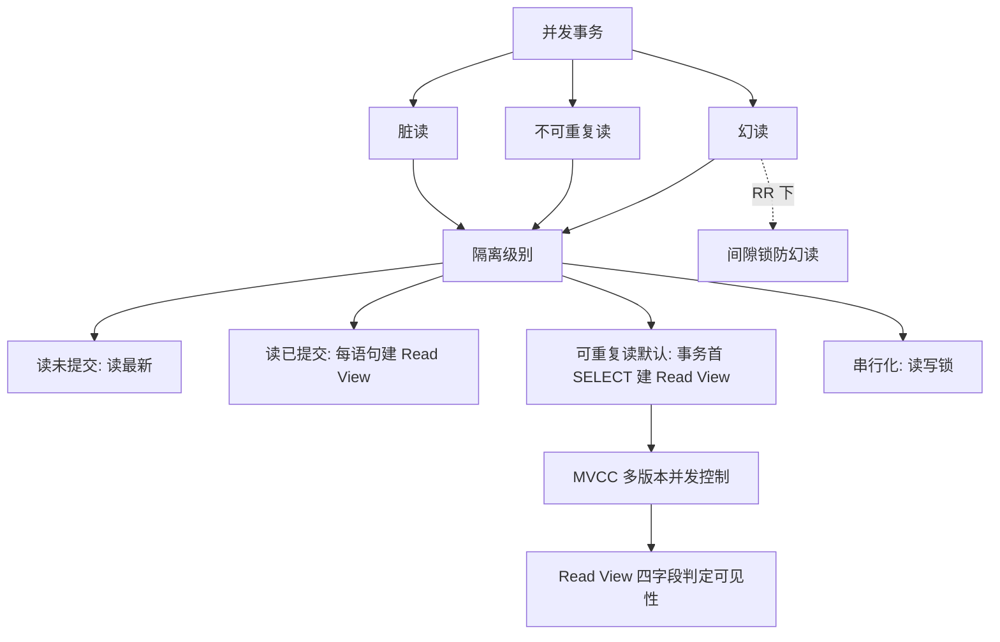
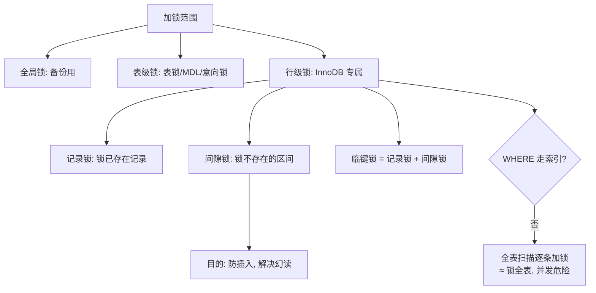
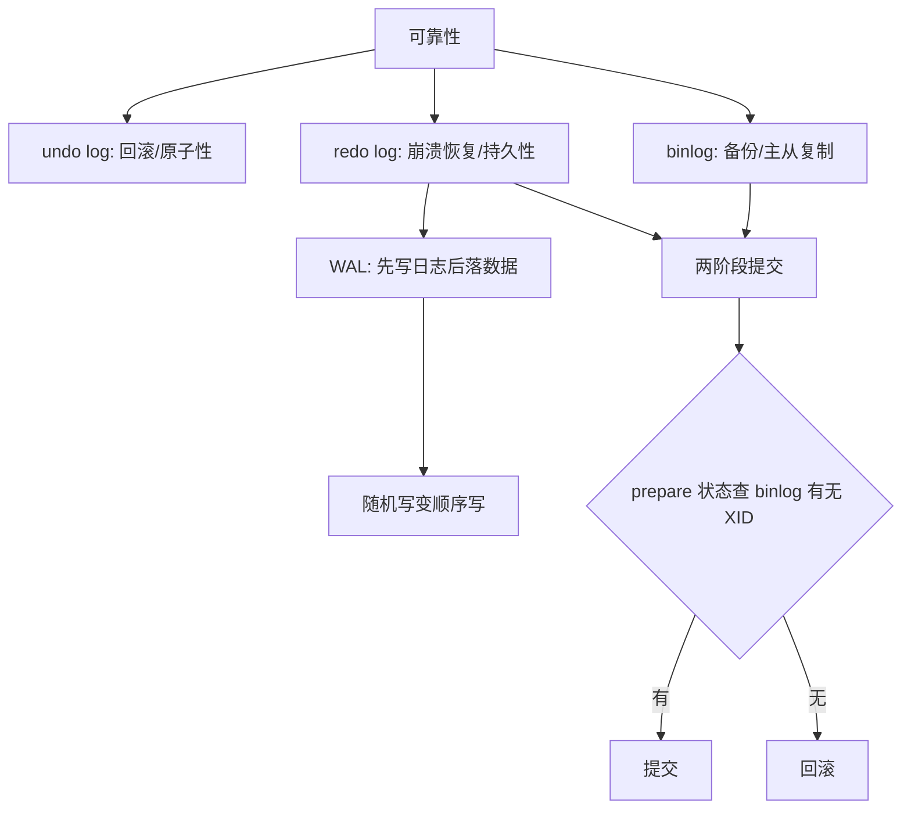
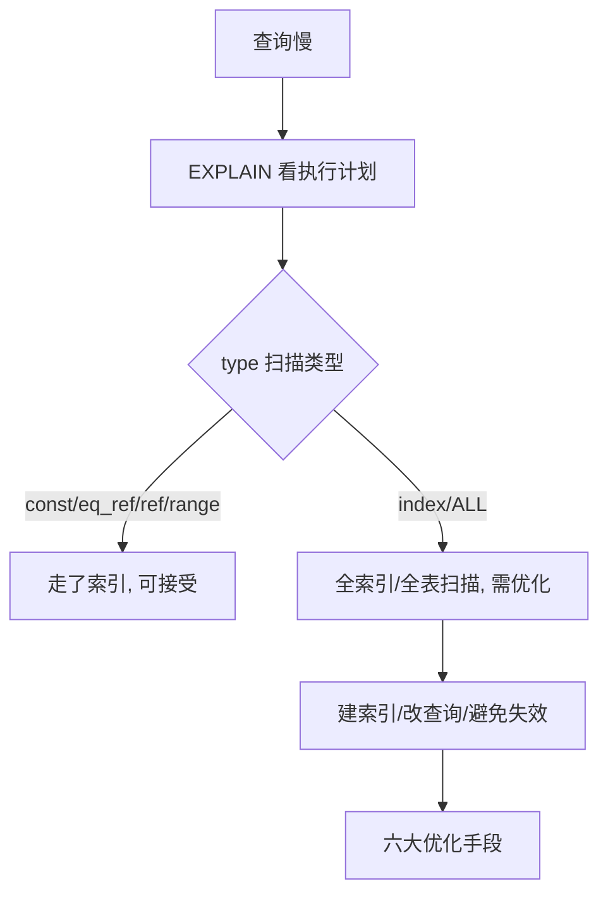

<script src="https://cdn.jsdelivr.net/npm/mermaid@10/dist/mermaid.min.js"></script>
<script>
document.addEventListener('DOMContentLoaded', function () {
  var blocks = document.querySelectorAll('pre code.language-mermaid');
  blocks.forEach(function (code) {
    var pre = code.parentNode;
    var div = document.createElement('div');
    div.className = 'mermaid';
    div.textContent = code.textContent;
    pre.parentNode.replaceChild(div, pre);
  });
  if (window.mermaid) {
    mermaid.initialize({ startOnLoad: false, theme: 'default' });
    mermaid.run({ querySelector: '.mermaid' });
  }
});
</script>

> 来源：`content/posts/mysql/30min-mysql-1.md`（原文件未改动）
> 本文档把原笔记整理成结构化学习文档，格式：是什么 → 核心原理 → 常用场景 → 代码示例
> 标注【补充】的章节为原笔记缺失或不完善、本文档新增的内容
> 每个章节开头用 Mermaid 图展示「概念 → 问题 → 解决 → 新问题」的知识链路

---

## 0. MySQL 整体架构【补充】



**核心原理**

- **连接器**：校验账号密码、获取权限，维护连接（`show processlist` 可看）。
- **分析器**：词法分析（识别关键字、表名、列名）+ 语法分析（检查 SQL 是否合法）。
- **优化器**：决定走哪个索引、多表连接顺序，目标是成本最低。
- **执行器**：调用存储引擎接口逐行执行，把结果返回给客户端。
- **存储引擎层**：真正读写磁盘数据；InnoDB 特有的 redo/undo log 在这一层。

**常用场景**

- 面试被问「一条 SQL 的执行过程」时，按 连接器→分析器→优化器→执行器→存储引擎 回答。
- 排查「为什么没走索引」：先看优化器的选择，再看索引是否失效。

---

## 1. 基础

### 1.1 知识链路



### 1.2 IN vs EXISTS

**是什么**：都是子查询写法。`IN` 是「拿这个值去集合里查」；`EXISTS` 是「子查询能找到一条记录就行」。

**核心原理**

- `IN`：先求出子查询结果集，再判断外层值是否属于该集合。
- `EXISTS`：外层每条记录分别执行子查询，**一找到匹配就立即停**，不扫完整结果集。
- 性能：子查询表很大时 `EXISTS` 通常更优；但优化器可能做改写，不能绝对化。

**常用场景**

- `IN`：集合判断，如 `id IN (1,2,3,4)`、`category_id IN (SELECT id FROM category WHERE status=1)`。
- `EXISTS`：关联存在性判断，如「至少购买过一次商品的用户」。

**代码示例**

```sql
-- IN：user.id 是否属于订单用户集合
SELECT * FROM user
WHERE id IN (SELECT user_id FROM `order`);

-- EXISTS：只要有订单就返回该用户
SELECT * FROM user u
WHERE EXISTS (
    SELECT 1 FROM `order` o WHERE o.user_id = u.id
);
```

### 1.3 NULL 与三值逻辑

**是什么**：SQL 比较结果有三个值：TRUE / FALSE / **UNKNOWN**，一旦涉及 NULL 就是 UNKNOWN。

**核心原理**

- `3 NOT IN (1,2,NULL)` 等价于 `3!=1 AND 3!=2 AND 3!=NULL` = `TRUE AND TRUE AND UNKNOWN` = **UNKNOWN**，WHERE 只保留 TRUE，记录被丢弃。
- `1 = NULL`、`NULL = NULL` 都是 UNKNOWN。

**代码示例**

```sql
-- 经典坑：order.user_id 里一旦有 NULL，期望的 3、4、5 全部查不出来
SELECT * FROM user
WHERE id NOT IN (SELECT user_id FROM `order`);
```

**常用场景**：`NOT IN` 子查询前先过滤 NULL（`WHERE user_id IS NOT NULL`），或改用 `NOT EXISTS`。

### 1.4 字段括号里的数字

| 类型 | 括号里的数字含义 |
| --- | --- |
| `INT(10)` | 历史显示宽度，现代 MySQL 基本无意义 |
| `VARCHAR(50)` | **最大字符长度**（重要） |
| `CHAR(20)` | **固定长度** |
| `DECIMAL(10,2)` | **总精度 10 位，小数 2 位** |

### 1.5 隐式类型转换【补充】

**是什么**：MySQL 比较字符串和数字时，会把字符串**隐式转成数字**再比较，内部通过 CAST 实现。

**核心原理**：索引列是字符串、条件传数字时，等于对索引列用了函数 → 索引失效。

**代码示例**

```sql
-- name 是 VARCHAR 索引列：触发隐式转换，索引失效
WHERE name = 123;   -- 实际执行 CAST(name AS signed) = 123
WHERE name = '123'; -- 正常走索引
```

---

## 2. 存储引擎

### 2.1 知识链路



### 2.2 InnoDB vs MyISAM

**是什么**：InnoDB 是 MySQL 默认存储引擎；MyISAM 是旧默认引擎。

**核心原理**

| 维度 | InnoDB | MyISAM |
| --- | --- | --- |
| 事务 | 支持（ACID） | 不支持 |
| 索引结构 | 聚簇索引，叶子存完整数据 | 非聚簇索引，索引存数据指针 |
| 锁粒度 | 行锁 | 表锁 |
| `COUNT(*)` | 全表扫描 | 直接读变量，极快 |
| 崩溃恢复 | redolog 恢复 | 不支持 |
| 外键 | 支持 | 不支持 |

**常用场景**：InnoDB 用于高并发读写业务；MyISAM 仅适合大量只读、不要求事务的场景（现代业务基本都用 InnoDB）。

### 2.3 数据文件三件套

**是什么**：进入 `/var/lib/mysql/my_test` 目录，一张表通常对应三个文件。

**核心原理**

- `db.opt`：数据库默认字符集和校验规则。
- `t_order.frm`：表结构定义（元数据）。
- `t_order.ibd`：表数据 + 索引。MySQL 5.6.6 起 `innodb_file_per_table` 默认 1，每表独立 `.ibd`；之前存共享表空间 `ibdata1`。

### 2.4 InnoDB 内存架构【补充】

**是什么**：InnoDB 用内存缓冲 + 多种优化机制提升读写性能。

**核心原理**

| 组件 | 作用 |
| --- | --- |
| Buffer Pool | 数据页缓存，读命中直接返回，写先改内存（脏页） |
| Change Buffer | 缓存二级索引的插入/更新操作，合并后批量落盘 |
| Adaptive Hash Index (AHI) | 对热点页自动建哈希索引，O(1) 查询（只能加速等值查询） |
| redo log buffer | 事务产生的 redo log 先入内存缓冲，再刷盘 |

**常用场景**：调优时关注 `innodb_buffer_pool_size`（建议为可用内存的 60%~75%）。

---

## 3. 索引

### 3.1 知识链路



### 3.2 索引分类（四个角度）

**核心原理**

- 按**数据结构**：B+Tree 索引、Hash 索引、Full-text 索引（5.6 后支持）。
- 按**物理存储**：聚簇索引（主键索引）、二级索引（辅助索引）。
- 按**字段特性**：主键索引、唯一索引、普通索引、前缀索引。
- 按**字段个数**：单列索引、联合索引。

**代码示例**

```sql
-- 前缀索引：对字符字段前几个字符建索引（char/varchar/binary/varbinary）
CREATE INDEX idx_name_prefix ON user (name(10));
```

### 3.3 B+Tree 结构与查找

**是什么**：InnoDB 索引用 B+Tree 实现——多叉树，叶子节点才存数据，非叶子只存索引，叶子间有双向链表。

**核心原理**

- 每个节点按主键顺序存放；父节点索引值都出现在子节点中。
- 查 `id=5`：根节点 (1,10,20) → 5 在 1 和 10 之间 → 第二层 (1,4,7) → 5 在 4 和 7 之间 → 叶子 (4,5,6) → 命中。读取一个节点 = 一次磁盘 I/O。
- **千万级数据只需 3~4 层高度，即 3~4 次磁盘 I/O**，这是比 B 树、二叉树最大的优势。
- 特性：所有叶子在同一层（延迟一致）；叶子双向链表（范围查询/排序扫描快）；自平衡。

**常用场景**：范围查询 `WHERE id BETWEEN 100 AND 200`、`ORDER BY id` 都能沿着叶子链表顺序访问。

### 3.4 聚簇索引、二级索引、回表与覆盖索引

**是什么**：一张 InnoDB 表通常有 1 棵聚簇索引树 + N 棵二级索引树，三棵树「装的东西不一样」。

**核心原理**

- 聚簇索引叶子节点 = **完整数据行**；建表时选主键规则：有主键用主键 → 无主键选第一个非 NULL 唯一列 → 都没有则隐式自增 id。
- 二级索引叶子节点 = **索引列 + 主键值**，不是完整行。
- **覆盖索引**：查询字段在二级索引里全都有，直接返回，不回表。
- **回表**：二级索引查到主键后，再回主键索引取完整记录。
- 因为辅助索引要回表，**主键不宜过大**，否则所有索引都被撑大。

**代码示例**

```sql
CREATE TABLE user (
    id BIGINT PRIMARY KEY,
    name VARCHAR(50),
    age INT,
    city VARCHAR(50),
    INDEX idx_age(age)
);

-- 覆盖索引：id、age 都在 idx_age 里，直接返回，不回表
SELECT id, age FROM user WHERE age = 20;

-- 回表：name 不在 idx_age 里，先走二级索引拿 id，再回主键索引取 name
SELECT id, age, name FROM user WHERE age = 20;
```

**常用场景**：高频查询尽量把字段塞进联合索引做成覆盖索引，是最高频的优化手段之一。

### 3.5 联合索引与最左匹配

**是什么**：多列组成的索引叫联合索引；查询必须从最左列开始匹配才生效（最左匹配原则）。

**核心原理**

- 联合索引先按第一列排序，第一列相同再按第二列排序 → b、c 是全局无序、局部有序。
- `(a,b,c)` 索引：`a=1`、`a=1 AND b=2`、`a=1 AND b=2 AND c=3` 都命中；`b=2`、`c=3`、`b=2 AND c=3` 全部失效。
- 优化器可调整 WHERE 书写顺序，a 的位置不影响。
- 同一列既是单列索引又在联合索引里：优化器按**成本估算**选索引，不固定。

### 3.6 索引失效的六种情况

**核心原理**

```sql
1. 左/左右模糊：    WHERE name LIKE '%xx'  /  '%xx%'
2. 对索引列用函数： WHERE SUBSTR(name,1,1) = '张'
3. 表达式计算：     WHERE id + 1 = 10
4. 隐式类型转换：   索引列是字符串，条件传数字（内部走 CAST）
5. 不满足最左匹配： WHERE b = 2
6. OR 中有无索引列： WHERE a = 1 OR b = 2（b 无索引 → 全表扫描）
```

**常用场景**：排查慢查询时逐一对照这 6 条。注意：MySQL 5.1 起有 `index_merge` 优化，OR 多索引可能合并读取，但依赖数据分布和优化器成本，不可依赖。

### 3.7 页目录：页内如何快速定位【原笔记重点】

**是什么**：B+Tree 找到的是「数据页」，页内还有几百条记录，靠 **Page Directory** 二分定位。

**核心原理**

- 页内记录按主键排序后**分组**，每组最后一条是该组最大记录（头信息 `n_owned` 记录组内数量）。
- 页目录只存每组最大记录的地址偏移量，即**槽（Slot）**。
- 查找：二分法先定位槽，再在槽内顺序遍历，无需从页头扫整个链表。

**代码示例**

```
记录分组：组0:1,2,3 | 组1:4,5,6 | 组2:7,8 | 组3:9,10,11,12 | 组4:13,14,15
槽：     Slot0→3  Slot1→6  Slot2→8  Slot3→12  Slot4→15

查 id=11：
① 二分 (0+4)/2=2 → Slot2 最大 8，11>8，去后半段
② 二分 (2+4)/2=3 → Slot3 最大 12，11<12，定位组 3
③ 从组 3 起点 9 向下找 2 次 → 命中 11
```

### 3.8 索引的优缺点与建索引原则

**核心原理**

- 优点：大幅提升查询速度。
- 缺点：占物理空间；创建/维护耗时；**降低增删改效率**（维护 B+Tree 有序性，索引列更新会触发结构调整）。

**常用场景**（何时建索引）

- 字段有唯一性限制（如商品编码）→ 唯一索引。
- 经常用于 WHERE → 单列或联合索引。
- 经常 GROUP BY / ORDER BY → 索引天然有序，免排序。

### 3.9 索引下推 ICP【补充】

**是什么**：Index Condition Pushdown，优化器把部分 WHERE 条件「下推」到索引层判断，减少回表次数。

**核心原理**

- 联合索引 `(name, age)`，查 `name LIKE '张%' AND age = 20`：无 ICP 时先按 name 匹配出所有记录再回表过滤 age；有 ICP 时在索引层就过滤 age，只有通过的才回表。

**常用场景**：Explain 的 Extra 显示 `Using index condition` 即生效。

### 3.10 为什么不用 B 树 / 红黑树【补充】

| 结构 | 问题 | 对比结论 |
| --- | --- | --- |
| B 树 | 非叶子节点也存数据，层数更高，I/O 更多 | B+ 树更矮胖，且叶子链表利于范围查询 |
| 红黑树 | 二叉树，千万级数据层高约 20+，I/O 次数多 | 不适合磁盘场景 |
| Hash 索引 | 等值 O(1)，但**不支持范围查询**、无序 | 适合等值查询场景 |

---

## 4. 事务

### 4.1 知识链路



### 4.2 ACID 与保证机制

**核心原理**：四个特性各有一个保证机制

| ACID | 保证机制 |
| --- | --- |
| 持久性 Durability | **redolog**（重做日志） |
| 原子性 Atomicity | **undolog**（回滚日志） |
| 隔离性 Isolation | **MVCC** 或锁机制 |
| 一致性 Consistency | 持久性 + 原子性 + 隔离性共同保证 |

### 4.3 并发三大问题（小林余额的例子）

**是什么**

- **脏读**：读到其他事务**未提交**的修改（该事务可能回滚 → 读到过期数据）。
- **不可重复读**：一个事务内两次读**同一行**，值不一样（其他事务提交了修改）。
- **幻读**：一个事务内两次查询**记录条数**不一样（其他事务插入/删除了记录）。

**核心原理**：区分关键——不可重复读是「行变了」，幻读是「条数变了」。

**代码示例**（对应场景）

```sql
-- 脏读：事务 A 改余额未提交，事务 B 读到新值
BEGIN; UPDATE account SET balance=200 WHERE id=1;  -- A 未提交
SELECT balance FROM account WHERE id=1;            -- B 读到 200（脏）

-- 幻读：事务 B 两次 count 不同
BEGIN; SELECT COUNT(*) FROM account WHERE balance > 100;  -- 5 条
-- 期间事务 A 插入一条 balance>100 并提交
SELECT COUNT(*) FROM account WHERE balance > 100;          -- 6 条
```

### 4.4 四种隔离级别

**核心原理**

| 隔离级别 | InnoDB 主要机制 | 脏读 | 不可重复读 | 幻读 |
| --- | --- | --- | --- | --- |
| 读未提交 READ UNCOMMITTED | 直接读最新版本 | 可能 | 可能 | 可能 |
| 读已提交 READ COMMITTED | MVCC + **每条语句**建 Read View | 避免 | 可能 | 可能 |
| 可重复读 REPEATABLE READ（默认） | MVCC + **事务首个 SELECT** 建 Read View | 避免 | 避免 | 基本避免（间隙锁） |
| 串行化 SERIALIZABLE | 加读写锁，冲突排队 | 避免 | 避免 | 避免 |

**代码示例**（Java 侧只需声明，不用手写 Read View）

```java
@Transactional(isolation = Isolation.REPEATABLE_READ)
public void test() {
    User u1 = userMapper.selectById(1);
    // do something
    User u2 = userMapper.selectById(1); // 与 u1 一致
}
// Spring → JDBC Connection → SET TRANSACTION ISOLATION LEVEL REPEATABLE READ
```

### 4.5 MVCC 与 Read View

**是什么**：MVCC（多版本并发控制）让多个事务同时读同一行而不互相阻塞，每个事务看到的是自己开始时（或语句开始时）的数据版本。

**核心原理**

- 行记录带版本信息（事务 id + 版本链，版本链由 undo log 串起）。
- Read View 可理解为「数据快照」，像相机拍照定格瞬间。四个字段：

| 字段 | 含义 |
| --- | --- |
| `m_ids` | 创建时**活跃未提交**事务的 id 列表 |
| `min_trx_id` | m_ids 的最小值 |
| `max_trx_id` | 创建时**下一个待分配**的事务 id（≠ m_ids 最大值） |
| `creator_trx_id` | 创建该 Read View 的事务自身 id |

- **可见性判定（补充）**：读取记录版本时，该版本的事务 id 若满足「小于 min_trx_id → 可见；大于等于 max_trx_id → 不可见；在 m_ids 里 → 不可见（未提交）；不在 m_ids 里 → 可见（已提交）」，命中不可见就沿 undo 版本链找下一版本。
- RC 与 RR 的区别：RC 每条 SELECT 前重新生成 Read View；RR 整个事务用同一个 → 这就是「可重复读」名字的来源。

**常用场景**：理解 RC/RR 行为差异、解释「为什么 RR 下两次查询结果一致」。

---

## 5. 锁

### 5.1 知识链路



### 5.2 三类锁

**核心原理**

- **全局锁**：`FLUSH TABLES WITH READ LOCK` 全库只读，用于全库逻辑备份。
- **表级锁**：
  - 表锁：`LOCK TABLES`，限制本线程和他人读写。
  - **MDL（元数据锁）**：CRUD 加读锁，结构变更加写锁，防止查询期间表结构被改。**经典事故**：慢查询长期持有 MDL 读锁 → 结构变更写锁排队 → 后续所有查询被堵死。
  - 意向锁：对记录加锁前先对表加意向锁，快速判断表中是否有记录被锁。
- **行级锁**：InnoDB 专属（MyISAM 不支持）。注意：网上常说的「页级锁」是已移除的 BDB 引擎特性。

### 5.3 记录锁 / 间隙锁 / 临键锁

**是什么**：行锁三兄弟，用于已存在的记录、不存在的区间、两者组合。

**核心原理**（account 表：id = 1, 3, 5, 8, 10）

- **记录锁 Record Lock**：`UPDATE ... WHERE id=5` 锁住已存在的 id=5；改 id=3 不阻塞。
- **间隙锁 Gap Lock**：`SELECT ... WHERE id>3 AND id<5 FOR UPDATE` 无记录命中，但锁住区间 **(3,5)**。锁「空气」是为了**防插入**——T2 想插入 id=4 会被阻塞，否则 T1 两次查询条数不同 = 幻读。
- **临键锁 Next-Key Lock**：记录锁 + 间隙锁，锁左开右闭区间如 `(1,3]`，防改删也防插入。

```sql
-- 间隙锁示例
BEGIN;
SELECT * FROM account WHERE id > 3 AND id < 5 FOR UPDATE;
-- T2 执行 INSERT INTO account(id, age, name) VALUES (4, 22, 'X') 会被阻塞
```

**核心口诀**：间隙锁防「插入」，记录锁防「修改/删除」，临键锁两个都防。

### 5.4 无索引 UPDATE 为什么危险

**是什么**：UPDATE/DELETE 的 WHERE 没走索引时，锁定读/更新会对**扫描到的每条记录加锁**，等于锁全表。

**核心原理**

- `UPDATE account SET name='XXX' WHERE age=20`，age 无索引 → 全表扫描，1/3/5/8/10 全被锁。
- 另一个事务 `WHERE age=25`（不同数据）也要全表扫描，扫到已锁记录就阻塞 → 两个无关事务互相卡死。

**常用场景**：生产铁律——UPDATE/DELETE 的 WHERE 条件必须走索引。

### 5.5 锁的兼容性与死锁【补充】

**是什么**：锁分 S 锁（共享锁/读锁）和 X 锁（排他锁/写锁）；死锁是两个事务互相等待对方持有的锁。

**核心原理**

- 兼容矩阵：S 与 S 兼容；S 与 X、X 与 X 互斥。
- 行锁是「两阶段锁」：事务中锁是逐步加的，提交/回滚时一起释放。
- 死锁处理：InnoDB 自动**死锁检测**（回滚代价小的事务，报 `Deadlock found`），或靠 `innodb_lock_wait_timeout` 超时放弃。

**代码示例**

```sql
-- T1: UPDATE account SET name='A' WHERE id=1;  UPDATE account SET name='A' WHERE id=2;
-- T2: UPDATE account SET name='B' WHERE id=2;  UPDATE account SET name='B' WHERE id=1;
-- T1 持 1 等 2，T2 持 2 等 1 → 死锁，InnoDB 检测后回滚一方
```

**常用场景**：多个事务按相同顺序加锁（如都先 id=1 再 id=2）可从源头避免死锁。

---

## 6. 日志

### 6.1 知识链路



### 6.2 日志总览

| 日志 | 层级 | 作用 |
| --- | --- | --- |
| redo log 重做日志 | InnoDB 层 | 持久性、掉电/崩溃恢复 |
| undo log 回滚日志 | InnoDB 层 | 原子性、事务回滚、MVCC 版本链 |
| binlog 二进制日志 | Server 层 | 数据备份、主从复制 |
| relay log 中继日志 | 主从场景 | 从库拷贝主库 binlog 后落地 |

### 6.3 undo log：记录「之前的值」

**是什么**：事务提交前记录更新前的数据，回滚时做相反操作。

**核心原理**

- 插入记录 → 记主键（回滚删掉）；删除记录 → 记整条内容（回滚插回）；更新记录 → 记旧值（回滚改回）。
- 同时是 MVCC 版本链的载体。

### 6.4 redo log 与 WAL：为什么还需要它

**是什么**：Buffer Pool 在内存，断电会丢脏页；WAL（Write-Ahead Logging）先写日志后落数据。

**核心原理**

- 更新时：先改内存（标记脏页）+ 把修改写进 redo log（物理日志：哪个表空间/数据页/偏移量/改了什么），更新就算完成；脏页由后台线程择机刷盘。
- **两个价值**：① crash-safe——已提交记录即使异常重启也不丢；② 写操作从磁盘**随机写变顺序写**（redo 追加写），性能提升。
- redo log 记录更新**之后**的状态；undo log 记录更新**之前**的状态。提交前崩溃 → undo 回滚；提交后崩溃 → redo 恢复。

### 6.5 binlog 与两阶段提交

**是什么**：binlog 是 Server 层追加写的日志，记录全部数据变更（不记 SELECT/SHOW），用于备份恢复和主从复制。为保证 binlog 与 redo log 一致，用**内部 XA 两阶段提交**。

**核心原理**

- prepare 阶段：把 XID 写入 redo log，状态置 prepare 并落盘。
- commit 阶段：把 XID 写入 binlog 并落盘 → 再调用引擎提交，redo 状态置 commit。
- 崩溃恢复：扫描 redo log 中 prepare 状态事务，拿 XID 查 binlog——**有则提交，无则回滚**。
- **以 binlog 写成功为事务提交成功的标志**。

### 6.6 一条 UPDATE 的完整执行流程

**核心原理**（`UPDATE t_user SET name='xiaolin' WHERE id=1`）

```
① 执行器通过主键索引找 id=1 行（数据页在 Buffer Pool 直接返回，否则先读入）
② 比较新旧记录：一样 → 结束；不一样 → 进入更新
③ 开事务，先写 undo log（旧值），undo 页修改也记 redo log
④ InnoDB 更新内存（标记脏页），修改写入 redo log → 更新完成（WAL，不立即落盘）
⑤ 记录 binlog 到 binlog cache（不落盘）
⑥ 提交：两阶段提交
   prepare：redo log 置 prepare 并刷盘
   commit：binlog 刷盘 → redo log 置 commit
⑦ 完成
```

**记忆口诀**：先 undo 后 redo，先 redo 后 binlog，binlog 落盘才算提交成功。

### 6.7 binlog 三种格式【补充】

**是什么**：binlog 有 STATEMENT、ROW、MIXED 三种格式。

**核心原理**

- **STATEMENT**：记录原始 SQL 语句，体积小，但 `now()` 等函数在主从执行结果可能不一致。
- **ROW**（5.7.7 后默认）：记录行变更前后数据，主从一致性强，但体积大。
- **MIXED**：混合，由 MySQL 按场景自动选择。

**常用场景**：Canal 等数据同步工具**必须用 ROW 格式**才能解析出具体变更数据。

### 6.8 主从复制流程【补充】

**是什么**：主库 binlog 同步到从库执行的链路。

**核心原理**

- 主库：事务提交写 binlog。
- 从库：I/O 线程拷贝主库 binlog 到本地 **relay log**；SQL 线程读取 relay log 并重放。
- 从 5.6 起默认**半同步/异步**：异步不保证不丢数据；半同步需主库确认从库收到 binlog 才返回提交成功。

---

## 7. 性能调优

### 7.1 知识链路



### 7.2 EXPLAIN 执行计划

**是什么**：在 SQL 前加 EXPLAIN 查看执行计划，分析是否走索引、是否外部排序、是否覆盖等。

**核心原理**（关键字段）

- `possible_keys`：可能用到的索引；`key`：实际用的索引（NULL = 没走索引）；`key_len`：索引长度；`rows`：预计扫描行数。
- `type` 扫描类型，效率从高到低：**const > eq_ref > ref > range > index > ALL**。

| type | 含义 | 例子 |
| --- | --- | --- |
| const | 主键/唯一索引 + 常量比较，结果最多一条 | `WHERE id = 1` |
| eq_ref | 多表联查，被驱动表用主键/唯一索引 | `JOIN ... ON a.user_id = b.id` |
| ref | 非唯一索引扫描，可能多条 | `WHERE name = '张三'` |
| range | 索引范围扫描 | `<`、`>`、`IN`、`BETWEEN` |
| index | 全索引扫描（免排序但开销大） | — |
| ALL | 全表扫描（最坏） | — |

**代码示例**

```sql
EXPLAIN SELECT * FROM user WHERE id = 100;
-- type=const、key=PRIMARY → 走索引
EXPLAIN SELECT * FROM user WHERE name = '张三';
-- name 建了索引：type=ref；key=NULL 说明失效（如用了函数）
```

**常用场景**：写 SQL 的目标是让 type 至少到 range 一档。

### 7.3 慢查询六大优化手段

**核心原理**

```
① 分析查询：EXPLAIN 定位全表扫描/索引未利用原因
② 创建/优化索引：WHERE、ORDER BY、JOIN、GROUP BY 字段建索引；
   多字段用联合索引并符合最左匹配
③ 避免索引失效：左模糊、函数、表达式、隐式转换
④ 查询优化：不用 SELECT *，只取需要的列；覆盖索引；小表驱动大表，
   被驱动表字段有索引；最好冗余字段避免联表
⑤ 分页优化：深分页 LIMIT 转按位置查询（主键自增的表）
⑥ 表设计优化：单表超千万考虑拆表；字段按访问频率拆分；
   引入 Redis 缓存热点数据（读走旁路缓存，写先更新 DB 再删缓存）
```

**代码示例**

```sql
-- 深分页优化：先定位到位置再取 10 条
SELECT * FROM tb_sku WHERE id > 20000 LIMIT 10;
```

### 7.4 慢查询日志配置【补充】

**是什么**：记录执行时间超过阈值的 SQL，用于定位慢查询。

**代码示例**

```sql
SET GLOBAL slow_query_log = 'ON';        -- 开启
SET GLOBAL long_query_time = 1;          -- 阈值 1 秒
-- 查看：SHOW VARIABLES LIKE 'slow_query_log%';
-- 配合 EXPLAIN 分析日志里捞出来的 SQL
```

### 7.5 Extra 字段常见值【补充】

| Extra 值 | 含义 |
| --- | --- |
| `Using index` | 覆盖索引，无需回表（最优） |
| `Using index condition` | 索引下推生效 |
| `Using where` | 服务层过滤 |
| `Using filesort` | 外部排序（ORDER BY 未走索引，需优化） |
| `Using temporary` | 用了临时表（GROUP BY/DISTINCT 常见） |
| `Using join buffer` | 连接缓冲（被驱动表无索引，注意） |

---

## 8. 面试自测清单

- [ ] 一条 SELECT / UPDATE 的执行流程能讲清楚（连接器→分析器→优化器→执行器→引擎）
- [ ] IN vs EXISTS 语义差异与场景，NOT IN + NULL 的坑
- [ ] InnoDB vs MyISAM 四维度对比
- [ ] B+Tree 为什么 3~4 层 I/O；聚簇/二级索引、回表、覆盖索引
- [ ] 联合索引最左匹配 + 六种索引失效
- [ ] 页目录如何二分定位记录
- [ ] 脏读/不可重复读/幻读的区别（行变 vs 条数变）
- [ ] 四种隔离级别实现（RC/RR 的 Read View 时机）
- [ ] Read View 四字段与可见性判定
- [ ] 记录锁/间隙锁/临键锁，以及无索引 UPDATE 的危险
- [ ] redo/undo/binlog 各自作用，两阶段提交的崩溃恢复判定
- [ ] EXPLAIN type 金字塔 + 六大优化手段
