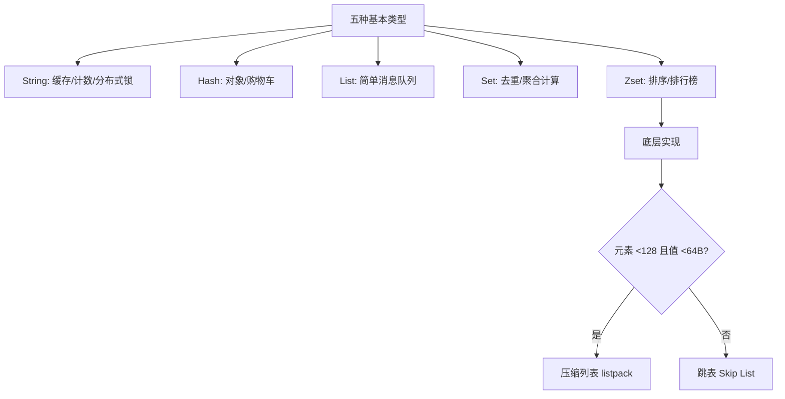
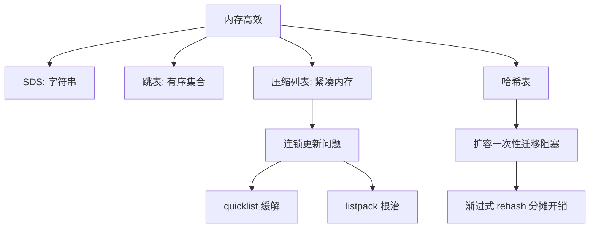
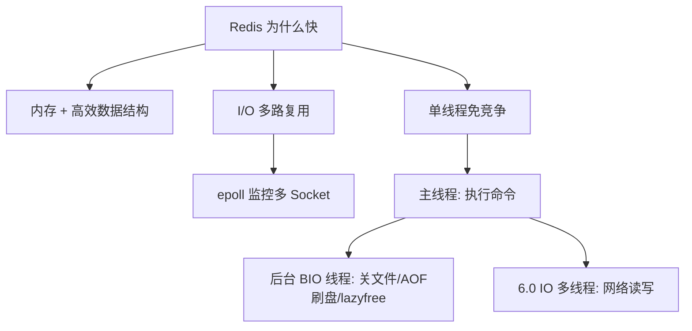
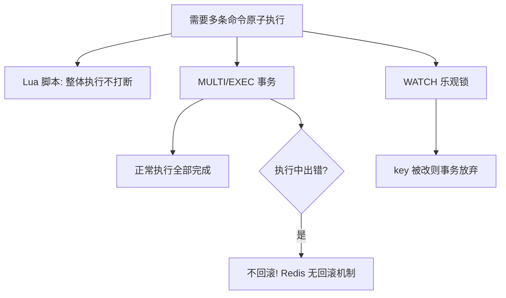
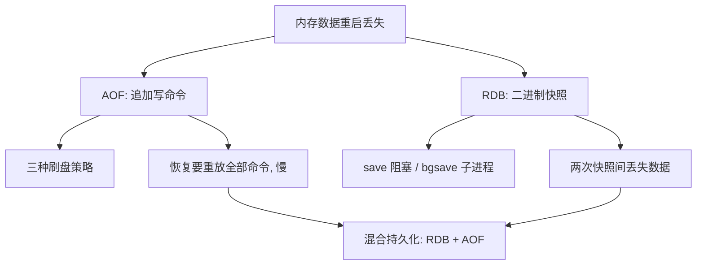
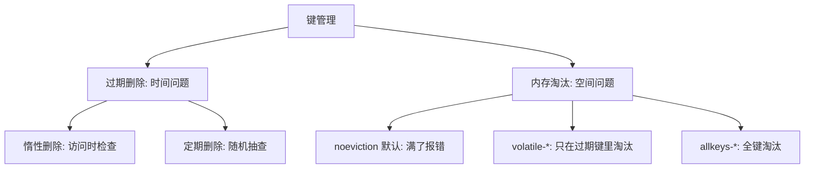
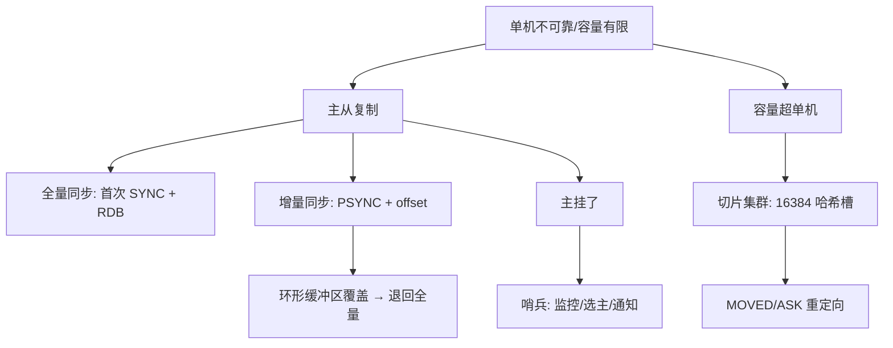
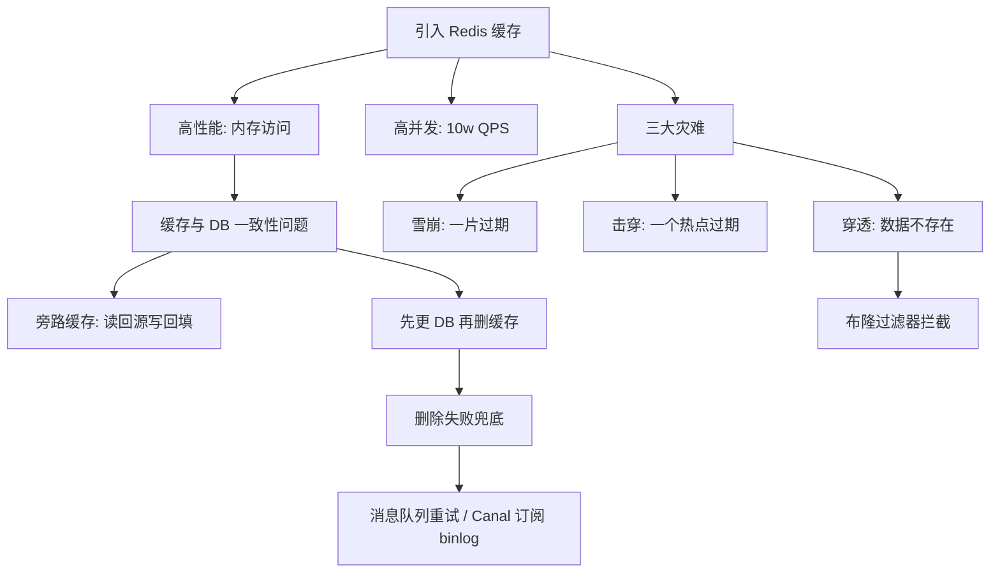
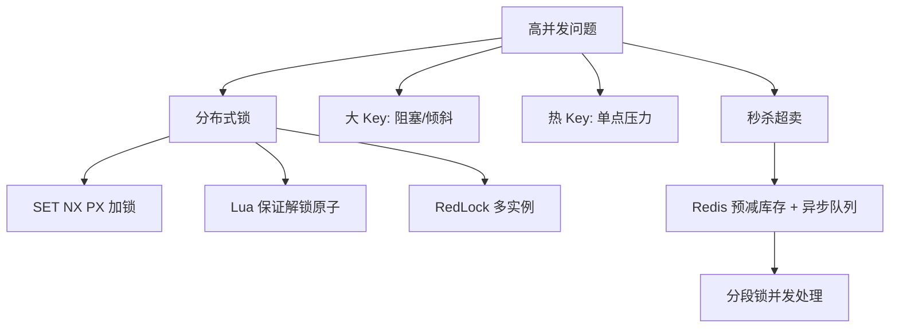

<script src="https://cdn.jsdelivr.net/npm/mermaid@10/dist/mermaid.min.js"></script>
<script>
document.addEventListener('DOMContentLoaded', function () {
  var blocks = document.querySelectorAll('pre code.language-mermaid');
  blocks.forEach(function (code) {
    var pre = code.parentNode;
    var div = document.createElement('div');
    div.className = 'mermaid';
    div.textContent = code.textContent;
    pre.parentNode.replaceChild(div, pre);
  });
  if (window.mermaid) {
    mermaid.initialize({ startOnLoad: false, theme: 'default' });
    mermaid.run({ querySelector: '.mermaid' });
  }
});
</script>

> 来源：`content/posts/redis/index.md`（Redis 面试题整理，原文件未改动）
> 本文档把原笔记整理成结构化学习文档，格式：是什么 → 核心原理 → 常用场景 → 代码示例
> 标注【补充】的章节为原笔记缺失或不完善、本文档新增的内容
> 每个章节开头用 Mermaid 图展示「概念 → 问题 → 解决 → 新问题」的知识链路

---

## 1. 数据类型

### 1.1 知识链路



### 1.2 九种类型与应用场景

**是什么**：Redis 常见五种类型 + 四种扩展类型，各有各的适用场景。

**核心原理**

- 五种基本类型：String、Hash、List、Set、Zset。
- 扩展类型：BitMap（2.2）、HyperLogLog（2.8）、GEO（3.2）、Stream（5.0）。

**常用场景**

```
String      → 缓存对象、常规计数、分布式锁、共享 session
List        → 消息队列（需自行实现全局唯一 ID；不能消费组消费）
Hash        → 缓存对象、购物车
Set         → 点赞、共同关注、抽奖（交集/并集/差集）
Zset        → 排行榜、电话/姓名排序
BitMap      → 签到、登录状态、连续签到统计
HyperLogLog → 百万级 UV 计数
GEO         → 滴滴叫车等地理位置
Stream      → 消息队列（自动生成全局唯一 ID，支持消费组）
```

### 1.3 Set vs ZSet

**核心原理**：Set 无序去重，只能做元素交并差；ZSet 每个元素带 score 按分数排序，多了排序、范围查询、排名计算能力。口诀：**Set 管「有没有」，ZSet 管「排第几」**。

**代码示例**

```bash
# Set
SADD set1 "a" "b" "c"          # 添加，重复自动去重
SMEMBERS set1                  # 查看全部（无序）
SISMEMBER set1 "a"             # 判断存在
SINTER set1 set2               # 交集；SUNION 并集

# ZSet
ZADD zset1 10 "a" 20 "b" 15 "c"    # 带分数添加
ZRANGE zset1 0 -1 WITHSCORES       # 按排名取（小→大）
ZRANGEBYSCORE zset1 12 25          # 按分数范围取
ZINCRBY zset1 5 "a"                # 分数 +5
ZRANK zset1 "b"                    # 排名（从 0 开始）
```

### 1.4 Zset 项目用法

**常用场景**

1. **排行榜**：游戏积分榜、商品销量榜——玩家 ID 为元素、积分为分数，`ZADD` 更新，`ZREVRANGE` 取前 10，`ZREVRANK` 查排名，`ZSCORE` 查积分，全部实时。
2. **延迟任务队列**：电商订单 30 分钟未支付自动取消——任务 ID 为元素、执行时间戳为分数，后台线程用 `ZRANGEBYSCORE` 捞「分数小于当前时间」的任务，执行完 `ZREM`，无需调度框架。
3. **范围查询**：积分 1000~2000 的玩家、销量 50~100 的商品，`ZRANGEBYSCORE` 一次筛出，比数据库排序高效。
4. **带权重消息队列**：重要消息分数更高，消费者优先处理。

**代码示例**

```bash
# 博文点赞排行榜：赞数 200/40/100/50/150
ZINCRBY article:rank 1 article:4          # 文章 4 新增一个赞
ZSCORE article:rank article:4            # 查赞数
ZREVRANGE article:rank 0 2               # 赞最多的前 3 篇
ZRANGEBYSCORE article:rank 100 200       # 100~200 赞的文章
```

### 1.5 对象系统 redisObject【补充】

**是什么**：Redis 每种类型都是一个 `redisObject`，由 `type`（类型）+ `encoding`（编码）+ `ptr`（指针）组成，同一类型可对应多种底层编码，按需切换。

**核心原理**（编码转换阈值）

| 类型 | 小数据量编码 | 大数据量编码 | 切换条件 |
| --- | --- | --- | --- |
| String | int / embstr | raw | 纯数字用 int；≤44 字节用 embstr |
| Hash | listpack（7.0 前 ziplist） | 哈希表 hashtable | 元素 ≤512 且每个 ≤64 字节 |
| List | listpack（3.2 前 ziplist） | quicklist | 元素 ≤512 且每个 ≤64 字节 |
| Set | intset（整数集合） | hashtable | 全整数且元素 ≤512 |
| Zset | listpack（7.0 前 ziplist） | 跳表 skip list | 元素 ≤128 且每个 ≤64 字节 |

**常用场景**：面试问「Zset 什么时候用压缩列表什么时候用跳表」——答：128 个元素 + 64 字节阈值；Redis 7.0 后压缩列表已被 listpack 取代。

---

## 2. 底层数据结构

### 2.1 知识链路



### 2.2 SDS：String 的底层

**是什么**：Simple Dynamic String，在 C 字符数组上增加元数据，解决 C 字符串三大缺陷。

**核心原理**

```
SDS 结构：len | alloc | flags | buf[]
① O(1) 获取长度      —— C 的 strlen 要遍历 O(N)
② 二进制安全        —— 用 len 记录长度而非 \0 结尾，可存任意二进制
③ 防缓冲区溢出      —— 修改前用 alloc-len 判断剩余空间，不够自动扩容
```

**代码示例**

```bash
# 效果演示：能安全存储包含 \0 的二进制数据
SET img "\x89PNG\r\n\x1a\n..."   # 普通字符串命令做不到的，SDS 可以
```

### 2.3 跳表 Skip List

**是什么**：Zset 大数据量时的底层结构，多层有序链表，查找 O(logN)。

**核心原理**

- 普通链表查找 O(N)；跳表叠加多层索引，高层直接跳过大量节点。
- 节点结构：`ele`（元素）+ `score`（分数）+ `backward`（后向指针，方便倒序）+ `level[]`（每层 forward 指针 + span 跨度）。
- **层高随机生成**：每次掷 [0,1) 随机数，<0.25 就加一层继续掷，否则停止；层高上限 64，头节点直接建 64 层。
- 不严格维持相邻层 2:1，靠概率保证平均性能。

**代码示例**（查找过程）

```
三层跳表：L0 节点 1~5；L1 节点 2、3、5；L2 节点 3
查节点 4：头节点走 L2 跳到 3 → 往前一格 → 2 次定位（普通链表要 4 次）
```

### 2.4 为什么用跳表不用 B+ 树

**核心原理**：场景适配问题。

| 特性 | 跳表 | B+ 树 |
| --- | --- | --- |
| 主要场景 | 内存数据库 | 磁盘数据库 |
| 查找复杂度 | 平均 O(logN) | O(logN)，树更矮 |
| 实现难度 | 低（几百行 C 代码） | 高（分裂/合并/重平衡） |
| 写操作代价 | 局部指针修改 | 可能连锁分裂，性能抖动 |

- B+ 树为磁盘设计，核心是降树高、减磁盘 I/O；Redis 纯内存，无磁盘 I/O 瓶颈，多几次指针跳转开销极小。
- 跳表实现简单、写操作局部化，契合 Redis 高频更新场景。结论：**B+ 树是磁盘场景最优解，跳表是内存有序数据场景最优解**。

### 2.5 压缩列表与连锁更新

**是什么**：为省内存设计的连续内存顺序结构（7.0 起废弃，被 listpack 替代）。

**核心原理**

```
表头四字段：zlbytes（总字节数）| zltail（尾节点偏移量）| zllen（节点数）| zlend（结束标记 0xFF）
节点三部分：prevlen（前节点长度）| encoding（类型+长度）| data（实际数据）
```

- 靠 zltail + zllen 定位首尾元素 O(1)，查其他元素 O(N)。
- **连锁更新**：每个节点存 prevlen，某节点变大 → 后续节点 prevlen 空间不够 → 连环扩容 → 多次内存重分配，性能下降。

### 2.6 quicklist 与 listpack

**是什么**：解决连锁更新的两代方案。

**核心原理**

- **quicklist（3.2）**：多个小压缩列表 + 双向链表组合，通过控制每个节点的大小减少连锁更新影响，但节点内部仍是压缩列表，没根治。
- **listpack（5.0）**：节点只含 `encoding | data | len`，**不再记录前一个节点的长度**——插入新元素不影响其他节点，连锁更新从根上消灭。Redis 7.0 全面替代压缩列表。

### 2.7 哈希表扩容与渐进式 rehash

**是什么**：Hash 底层哈希表数据量增长时触发 rehash；一次性迁移会阻塞 Redis，所以用渐进式。

**核心原理**

```
普通 rehash 三步：
① 给哈希表 2 分配空间（约 2 倍）
② 把哈希表 1 数据一次性迁到表 2（大表会阻塞！）
③ 释放表 1，表 2 转正

渐进式 rehash：
① 分配空间
② 每次增删改查顺带迁移一小批数据
③ 查询先查表 1 再查表 2；新增只写表 2（表 1 只减不增）
```

**核心要点**：把一次性大迁移的开销摊平到每次请求，Redis 不阻塞。这也是「为什么叫渐进式」的答案。

### 2.8 整数集合 intset【补充】

**是什么**：Set 全整数且元素少时的底层结构，有序整数数组，二分查找。

**核心原理**

- 数组按从小到大有序排列，查找 O(logN)。
- 升级策略：插入更大整数时整体升级编码（16→32→64 位），升级不可逆。
- 元素超过 512 个或混入字符串 → 转哈希表。

---

## 3. 线程模型

### 3.1 知识链路



### 3.2 Redis 为什么快

**核心原理**

1. 大部分操作在内存完成 + 高效数据结构 → 瓶颈是内存/带宽而非 CPU，无需多线程。
2. 单线程避免线程竞争、上下文切换、死锁。
3. **I/O 多路复用**：一个线程同时监听多个 Socket，内核监控就绪状态，谁有数据处理谁。

**常用场景**：官方基准测试单线程可达 **10W QPS**；4 核 8G 单节点缓存命中时可支撑 10w QPS，MySQL 同配置只有约 5000。

### 3.3 单线程的真相

**是什么**：Redis 单线程指「接收→解析→执行→返回」主链路，程序本身是多线程的。

**核心原理**

```
主线程：Redis-server，执行命令 + 网络 I/O
3 个 BIO 后台线程：
  bio_close_file → 关闭文件
  bio_aof_fsync  → AOF 刷盘
  bio_lazy_free  → 异步释放内存（lazyfree）
```

- 2.6 起有关文件、AOF 刷盘两个后台线程；4.0 起加 lazyfree 线程——`UNLINK`/`FLUSHDB ASYNC` 把删除交给后台，**DEL 删大 Key 会卡主线程，必须用 UNLINK**。
- 6.0 起网络 I/O 可配多线程（`io-threads`，默认 1 关闭），但**命令执行仍是单线程**；读请求多线程还要额外开 `io-threads-do-reads yes`；线程数建议小于核数（4 核 2~3，8 核 6）。

**代码示例**

```bash
UNLINK big_key            # 异步删除，主线程不卡
FLUSHDB ASYNC             # 异步清库
```

### 3.4 I/O 多路复用与网络模型

**是什么**：一个线程检查多个 Socket 就绪状态的技术；「多路」= 多连接，「复用」= 复用同一线程。

**核心原理**

- 每个客户端连接对应一个文件描述符 FD；Redis 把 FD 注册进 epoll 监听列表，有读/写事件就回调对应处理器，不阻塞等待任一客户端。
- 整体是 **Reactor 模式**：6.0 前单 Reactor 单线程（实现简单、无竞争，但用不满多核、业务耗时会影响整体）；6.0 后网络 I/O 多线程，命令执行仍单线程。

### 3.5 Pipeline【补充】

**是什么**：把多条命令一次批量发送，减少 RTT（网络往返），而不是逐条等结果。

**代码示例**

```bash
# 伪代码：普通方式 N 条命令 = N 次 RTT
for cmd in cmds: send(cmd); wait_reply()
# Pipeline：一次发送 N 条，一次性收 N 个结果（1 次 RTT）
pipe = client.pipeline(); [pipe.cmd(c) for c in cmds]; pipe.execute()
```

**核心要点**：Pipeline 不是事务，命令间无原子性保证；适合批量写场景（如批量写入、预热缓存）。

---

## 4. 事务与原子性

### 4.1 知识链路



### 4.2 原子性的三种手段

**核心原理**

- **单命令原子**：Redis 单线程执行命令，单命令天然无竞争。
- **Lua 脚本**：整个脚本作为整体执行，中间不被其他命令打断——分布式锁的解锁判断+删除就是用它保证原子性。
- **MULTI/EXEC 事务**：正常执行可保证全部完成；**执行中出错不回滚**（Redis 没有回滚机制）。例：LPOP 对 String 执行在 EXEC 时报错，DECR 仍成功。

**代码示例**

```bash
MULTI
SET key1 "a"
LPOP key1        # 入队不报错，EXEC 执行时报错
DECR key1        # 这条仍然成功执行（不回滚）
EXEC
```

**记忆要点**：Redis 事务 ≠ 数据库事务；需要强原子性用 Lua。

### 4.3 WATCH 乐观锁【补充】

**是什么**：事务执行前用 WATCH 监听 key，EXEC 时若 key 被其他客户端修改，事务直接放弃（返回 nil），实现 CAS 效果。

**代码示例**

```bash
WATCH stock:100
val = GET stock:100
MULTI
DECR stock:100
EXEC          # 若期间 stock:100 被改，EXEC 返回 nil，事务不执行
```

**常用场景**：简单库存扣减、防止超卖的低配方案（高并发仍建议 Lua 或分布式锁）。

---

## 5. 持久化

### 5.1 知识链路



### 5.2 三种持久化方式

**核心原理**

| 方式 | 原理 | 优点 | 缺点 |
| --- | --- | --- | --- |
| AOF | 每条写命令追加到文件 | 最多丢 1 秒（everysec），安全 | 文件大；恢复慢（重放命令） |
| RDB | 某一瞬间内存二进制快照 | 文件小、恢复快；bgsave 不阻塞 | 两次快照之间丢数据 |
| 混合（4.0） | AOF 重写时先写 RDB 再追加 AOF | 恢复快 + 丢得少 | 文件结构复杂 |

**常用场景**：对数据安全要求高的用 AOF（everysec 默认）；允许少量丢失、追求恢复速度的用 RDB；4.0+ 一般开混合持久化。

### 5.3 AOF 三种刷盘策略

**核心原理**：写命令先到 aof_buf → write 到内核 page cache → fsync 决定落盘时机。

| appendfsync | 时机 | 安全性 | 性能 |
| --- | --- | --- | --- |
| Always | 每条命令立即 fsync | 最高，丢 0 数据 | 最差 |
| Everysec | 每秒后台刷一次 | 最多丢 1 秒（默认） | 折中 |
| No | 交给操作系统 | 丢失不可控 | 最好 |

### 5.4 AOF 重写【补充】

**是什么**：AOF 文件过大时，把内存当前状态压缩成一条条等价命令重写，缩小文件、加快恢复。

**核心原理**

- 由 `bgrewriteaof`（或自动触发：文件超过上次重写后大小的一定比例）在**子进程**执行。
- 重写期间新命令进 AOF 缓冲区，重写完成后追加，保证不丢。
- 混合持久化下，重写产物 = RDB 段 + AOF 段。

### 5.5 重启恢复优先级【补充】

**是什么**：Redis 重启时从哪个文件恢复。

**核心原理**：优先级 **混合 > AOF > RDB**——只要 AOF（或混合文件）存在就优先加载它，因为 AOF 数据更完整；只有 AOF 不存在时才加载 RDB。

---

## 6. 过期删除与内存淘汰

### 6.1 知识链路



### 6.2 过期删除策略

**核心原理**

- **惰性删除**：访问/修改 key 前调用 `expireIfNeeded` 检查，过期就删（异步或同步由 lazyfree_lazy_expire 决定），不访问不删。
- **定期删除**：每秒 10 次（`hz` 配置，默认 10），每轮从过期字典**随机抽 20 个 key**；过期占比 >25%（超过 5 个）继续抽，单轮上限 25ms。
- 为什么不过期立即删：过期键多时删除占大量 CPU，内存不紧张时浪费 CPU 不值得。

**代码示例**

```bash
# 伪代码：定期删除逻辑
while 耗时 < 25ms:
    随机抽 20 个 key
    删除其中过期的
    if 过期比例 <= 25%: break
```

### 6.3 八种内存淘汰策略

**核心原理**

```
不淘汰：    noeviction（3.0 后默认）——内存满时新写入报错，读写不影响
过期键里：  volatile-random  随机
            volatile-ttl     优先淘汰更早过期的
            volatile-lru     最久未使用
            volatile-lfu     最少使用（4.0 新增）
全部键：    allkeys-random   随机
            allkeys-lru      最久未使用
            allkeys-lfu      最少使用（4.0 新增）
```

**常用场景**：生产一般配 `allkeys-lru` 或 `allkeys-lfu`（热点数据天然保留）；注意 32 位系统 maxmemory 默认 3G。

---

## 7. 集群

### 7.1 知识链路



### 7.2 主从同步

**核心原理**

```
全量同步（初次/数据丢失/差异过大）三阶段：
① 从库发 SYNC
② 主库生成 RDB 发送；期间新写命令写入 repl_backlog_buffer（环形缓冲）
③ RDB 传完，补发缓冲期间命令

增量同步（断线重连）：
① 从库发 PSYNC（带自己的 slave_repl_offset）
② 主库比对 master_repl_offset，差异数据若还在环形缓冲区 → 增量补发
③ 若已被环形缓冲覆盖 → 退回全量同步（性能损耗大）
```

- `repl_backlog_buffer` 默认 1M，写满覆盖旧数据；主写快从读慢时容易覆盖 → **尽量调大**，减少频繁全量同步。
- CAP 定位：主从/集群属于 **AP 模型**——分区时保可用性和分区容忍，牺牲强一致，可能出现节点间数据不一致。

**常用场景**：读多写少时读写分离（从库扛读）；但不能依赖它保证强一致。

### 7.3 哨兵 Sentinel

**是什么**：2.8 起提供，特殊模式下的 Redis 进程，负责**监控、选主、通知**，实现故障转移。

**核心原理**（四步）

```
① 主观下线：单个哨兵心跳超时（down-after-milliseconds）→ 判主观下线
② 客观下线：超过 quorum 个哨兵确认 → 判客观下线；主节点才触发故障转移
③ 选哨兵 Leader：拉票数 ≥ max(quorum, 哨兵数/2+1) 当选
   （如 3 哨兵 quorum=2，拿 2 票即胜出）
④ 选新主：过滤故障节点 → slave-priority 最大 → 复制偏移量最大（数据最全）
   → runid 最小
```

### 7.4 切片集群 Redis Cluster

**是什么**：数据量大到单机放不下时，把数据分片到多节点的集群方案。

**核心原理**

```
key → 节点 映射：
key → CRC16(key) 算 16 bit 值 → 对 16384 取模 → 槽号（0~16383）→ 节点

槽分配：
平均分配：cluster create 自动均分
手动分配：cluster meet + cluster addslots（16384 个槽必须全部分完）

客户端寻址：
启动时 CLUSTER SLOTS 拿全量「槽位-节点」映射缓存
访问 key：算槽号 → 查本地缓存 → 直连节点
节点变动：收到 MOVED（永久，更新缓存）/ ASK（临时）重定向，自动更新
```

**优缺点**

- 优点：高可用（主从复制容错）、高性能（分片）、扩展性好（动态加节点）。
- 缺点：部署运维复杂；数据同步延迟；分片限制跨节点操作（如一次修改多个 key 可能因节点变化失败）。

### 7.5 集群脑裂【补充】

**是什么**：主从之间网络分区，哨兵选出新主，旧主还在服务写入，网络恢复后旧主数据被丢弃。

**核心原理**

- 分区期间旧主继续接收写请求，但这些数据不在新主上，恢复后旧主降为从库、数据被清空重同步 → 这段时间的写入丢失。
- 缓解：`min-replicas-to-write`（主库最少有几个从库才接受写）+ `min-replicas-max-lag`（从库延迟上限），延迟超限时主库拒绝写入，减少脑裂丢失。

**常用场景**：对写入可靠性要求高的集群务必配置这两个参数。

---

## 8. 缓存场景

### 8.1 知识链路



### 8.2 为什么用 Redis / 为什么比 MySQL 快

**核心原理**

- Redis 高性能：内存读写，用户数据缓存进 Redis 后二次访问直接命中内存。
- Redis 高并发：单机 QPS 轻松 10w+，MySQL 单机难破 1w——请求先打缓存，数据库只承受回源流量。
- 比 MySQL 快的三个原因：内存 vs 磁盘；简单键值结构（哈希 O(1) vs B+Tree O(logN)）；单线程免竞争。

### 8.3 本地缓存 vs Redis（分布式缓存）

| 维度 | 本地缓存（Caffeine/Guava） | 分布式缓存（Redis） |
| --- | --- | --- |
| 速度 | 更快（本机内存） | 有网络开销 |
| 扩展性 | 受单机硬件限制 | 可动态扩展 |
| 一致性 | 各实例独立，天然不一致 | 多实例共享一份数据 |
| 适用 | 单实例配置、临时计算结果 | 多实例共享状态、分布式 session、全局热点 |

### 8.4 缓存雪崩 / 击穿 / 穿透

**是什么**（一字之差，别混）

- **雪崩**：大量缓存同一时间过期或 Redis 宕机 → 全部请求直达数据库。
- **击穿**：**单个**热点 key 过期，恰逢大量请求访问。
- **穿透**：请求的数据缓存和数据库**都不存在**，缓存永远建不起来。

**核心原理**（解法）

```
雪崩：① 过期时间加随机数 ② 互斥锁（只让一个请求重建缓存）③ 后台更新缓存不设过期
击穿：① 互斥锁 ② 热点不设过期时间，后台异步更新/快过期提前刷新
穿透：① 入口校验非法参数 ② 缓存空值/默认值 ③ 布隆过滤器
```

**记忆口诀**：雪崩是「一片」，击穿是「一个热点」，穿透是「不存在」。

### 8.5 布隆过滤器

**是什么**：位图数组 + N 个哈希函数，快速判断数据是否「可能存在」。

**核心原理**

- 写入：N 个哈希函数算出 N 个哈希值 → 对位图长度取模 → 对应位置置 1。
- 查询：算 N 个位置，**任一为 0 → 一定不存在**（直接拦截，不查数据库）；全为 1 → 可能存在。
- 特性：存在可能误判（哈希冲突），不存在**一定准确**——「说存在不一定存在，说不存在一定不存在」。
- 例：位图长 8、3 个哈希函数，写入 x 落到第 1、4、6 位；查询 x 看这三位。

**常用场景**：防缓存穿透、爬虫 URL 去重、黑名单快速过滤。

### 8.6 缓存一致性

**核心原理**

- 读：**旁路缓存**——先查缓存，未命中查 DB 并回填。
- 写：**先更新 DB，再删缓存**（删比更安全：并发下更新缓存容易产生脏数据，删掉让下次读重新加载）。
- 本质：缓存是牺牲强一致换性能（CAP 的 AP），只能做到最终一致。
- 缓存必须设过期时间：太短失去缓存意义（请求多落库），太长脏数据滞留、浪费内存。

**代码示例**（删缓存失败的兜底）

```
方案 1：消息队列重试
  删除缓存失败 → 把删除操作丢进 MQ → 消费者重试 → 超过次数告警
方案 2：Canal 订阅 binlog（推荐，无侵入）
  Canal 伪装成 MySQL 从节点 → 主库推送 binlog → Canal 解析后发到 MQ
  → 消费者根据变更删缓存 → ACK 确认
```

---

## 9. 高并发实战

### 9.1 知识链路



### 9.2 分布式锁

**是什么**：分布式环境下保证资源同一时刻只被一个应用访问的锁。

**核心原理**

- 加锁三要素：`SET lock_key unique_value NX PX 10000`——NX 保证 key 不存在才设置（抢锁）；PX 设过期时间防客户端崩了锁不释放；unique_value 唯一标识防误删别人的锁。
- 解锁两操作（判断+删除）必须用 **Lua 脚本**保证原子性。
- 可靠性升级：**RedLock**——在多数（>半数）独立 Redis 实例上同时加锁成功才算拿到锁，减少单点故障影响。

**代码示例**

```bash
# 加锁
SET lock:order unique_value_123 NX PX 10000

# 解锁（Lua 保证原子）
if redis.call("get", KEYS[1]) == ARGV[1]
then redis.call("del", KEYS[1])
     return 1
else return 0 end
```

### 9.3 大 Key 问题

**是什么**：value 过大（字符串 >1M，或集合元素 >1 万个；高并发低延迟场景 10KB 就可能算）。

**核心原理**（五个危害）

```
① 内存占用过高，可能触发淘汰甚至 OOM
② 性能下降（操作大 key 消耗更多 CPU/内存）
③ 阻塞其他操作：DEL 删大 key 会卡住 Redis
④ 网络拥塞：1MB key × 1000 次/秒 = 1000MB 流量
⑤ 主从同步延迟 + 集群数据倾斜
```

**解决方案**

```
① 拆分：几万成员的 Hash 拆成多个小 Hash（集群下还能平衡分片）
② 清理：不适用 Redis 的数据挪走；删除用异步（UNLINK）
③ 监控：内存使用率 >70% 或 1 小时增长 >20% 报警
④ 定期清理过期堆积数据
```

### 9.4 热 Key 问题

**是什么**：访问频率极高的 key（如总 QPS 1 万中单个 key 占 7000）。

**解决方案**

- **复制热 Key**：把 hot key 复制成 foo2/foo3/foo4 迁到不同分片，分散单分片压力。
- **读写分离**：热 key 源于读请求时加从节点分担；注意增加代理层（Proxy/LVS）和故障率复杂度。

### 9.5 秒杀场景设计

**是什么**：用 Redis 原子性挡住大部分流量，数据库只扛真正成交的请求。

**核心原理**（完整链路）

```
① 初始化：库存加载进 Redis
② 预减库存：DECR stock 原子扣减；<=0 直接返回秒杀失败
③ 成功请求进异步队列，返回「排队中」
④ 异步队列出队 → 校验是否重复秒杀 → 生成订单 → 扣数据库库存
⑤ 客户端轮询秒杀结果

进阶：分段库存 —— 100 件库存拆 5 个 key，user_id % 5 定位，5 个请求并发处理；
      某段卖完需自动换段（复杂度较高）
```

**核心要点**：数据库 `SELECT ... FOR UPDATE` 排他锁方案高并发下性能差、易超时，只做兜底；主力是 Redis 预减库存 + 异步落库。

### 9.6 内存碎片【补充】

**是什么**：数据删除/修改后内存空间无法连续利用，造成碎片。

**核心原理**

- 产生原因：频繁增删、key 值大小差异大、过期删除。
- 查看：`INFO memory` 里的 `mem_fragmentation_ratio`（>1.5 偏严重）。
- 解决：`CONFIG SET activedefrag yes` 开启自动整理（4.0 起）。

### 9.7 慢查询日志与监控【补充】

**是什么**：记录执行时间超过阈值的命令，定位慢操作。

**代码示例**

```bash
CONFIG SET slowlog-log-slower-than 10000   # 阈值 10ms
CONFIG SET slowlog-max-len 128
SLOWLOG GET 10                             # 查看最近 10 条慢命令
```

**常用场景**：排查大 Key、`KEYS *`、`SMEMBERS` 等危险命令——生产禁用 `KEYS *`（O(N) 阻塞），用 `SCAN` 代替。

---

## 10. 面试自测清单

- [ ] 九种数据类型与各自应用场景
- [ ] Set vs ZSet 区别；Zset 排行榜/延迟队列用法
- [ ] SDS 三大优势（O(1) 长度/二进制安全/防溢出）
- [ ] 跳表结构与层高概率（0.25/64 层）；为什么不用 B+ 树
- [ ] 压缩列表连锁更新；listpack 如何根治
- [ ] 渐进式 rehash 步骤与「为什么不能一次性迁移」
- [ ] 对象编码转换阈值表（128/64、512 等）
- [ ] Redis 为什么快三原因；单线程真相（BIO/lazyfree/6.0 IO 多线程）
- [ ] 单命令/Lua/MULTI-EXEC 三种原子性手段；WATCH 乐观锁
- [ ] AOF 三种刷盘策略；RDB save/bgsave；混合持久化；重启加载优先级
- [ ] 惰性+定期删除参数（hz 10/抽查 20/25%/25ms）；8 种淘汰策略
- [ ] 主从全量/增量同步、环形缓冲区、哨兵四步选主、16384 哈希槽
- [ ] 雪崩/击穿/穿透区别与解法；布隆过滤器原理与误判特性
- [ ] 缓存一致性：旁路缓存、先更 DB 再删缓存、MQ 重试/Canal
- [ ] 分布式锁 SET NX PX + Lua 解锁；RedLock
- [ ] 大 Key/热 Key 危害与解决；秒杀五步链路
